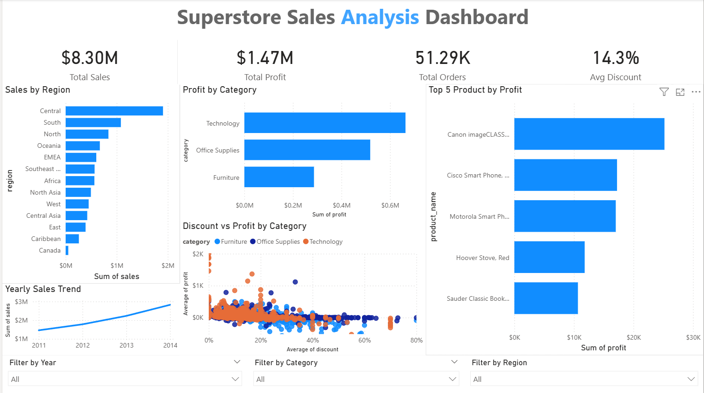

# SuperStore Sales Analysis
> Status: Completed | July 2026

## About
**Analyst:** Kushagra Yadav

**Tools:** Python | SQLite | Power BI | Git

**Dataset:** 51,290 orders | Superstore Sales Order | 2011-2014

---

## Objective

To analyze 4 years of Superstore sales data and uncover key insights around regional performance, product profitability, discount impact, and business growth trends - with actionable recommendations for business decision makers.

---

## Tools Used

- **Python** (Pandas, NumPy, Matplotlib, Seaborn) - Data cleaning, EDA, visualization
- **SQL** (SQLite) - Business queries and aggregations
- **Power BI** - Interactive 2-page dashboard
- **Git & GitHub** - Version control

---

## Project Structure

SuperStore_EDA/
* charts/
  - `1_sales_by_region.png`
  - `2_profit_by_region.png`
  - `3_yearly_trend.png`
  - `4_category.png`
  - `5_discount_profit.png`
  - `6_top10_products.png`
  - `7_heatmap.png`
  - `Sales_complete_overview.png`
  - `Product_analysis.png`

* `SuperStoreOrders.csv`
* `SuperStore_Cleaned.csv`
* `Superstore_Dashboard.pbix`
* `Superstore_sales_analysis.ipynb`
* `README.md`
* `.gitignore`

---

## Business Questions Answered

1. Which region generates the highest revenue and profit?
- **Ans.1:** Central region - $1.9M in total sales

2. Which products are most and least profitable?
- **Ans.2:** Most profitable - Canon imageCLASS 2200 Copier at $25,199 profit. Least profitable - Cubify CubeX 3D Printer at -$8,879 loss on $675 in sales.

3. How does discount affect overall profit?
- **Ans.3:** Discount above 20% push orders into loss territory

4. Which categories and sub-categories perform best?
- **Ans.4:** Office Supplies -> Appliances at **36.11% profit margin**

5. Is the business growing year over year?
- **Ans.5:** Yes - consistent year over year growth 2011 - 2014

---

## Key Insights

### 1. Regional Performance
- Central region leads in total sales ($1.9M)
- Canada is the least profitable market
- High sales volume does not guarantee profitability
- **Recommendation:** Audit Canada operations and review regional discount strategies.

### 2. Product Performance
- **Best:** Canon imageCLASS 2200 Copier -> **$25,199 profit**
- **Worst:** Cubify CubeX 3D Printer -> **$8,879 loss** on $675 in sales
- Technology products dominate both top performers and loss makers
- **Recommendation:** Discontinue worst performers, increase focus on top profit drivers.

### 3. Discount Impact - Most Critical Finding
- Orders with **0–20% discount** -> profitable
- Orders with **20–40% discount** -> average loss of $42.88 per order
- Orders with **40%+ discount** -> total losses of **$627,411**
- This is over 40% of the company's total profit being wiped out by discounting
- **Recommendation:** Cap all discounts at 20% company-wide immediately

### 4. Category Performance
- Technology -> highest sales and profit
- Office Supplies -> Appliances = best profit margin at **36.11%**
- Furniture -> high sales but lowest profit - severely over-discounted
- **Recommendation:** Prioritize Appliances in marketing. Audit Furniture pricing.

### 5. Business Growth
- Consistent year-over-year revenue growth from 2011 to 2014
- But profit growth is being eaten by poor discount management
- **Recommendation:** Fix discount policy to convert revenue growth into real profit growth

---

## Executive Summary

Analysis of 51,290 orders reveals that despite consistent year-over-year revenue growth from 2011–2014, the business is losing **$600,000+** annually - over 40% of total profit - due to an ineffective discount strategy. Implementing a 20% discount cap company-wide would recover this loss without requiring any increase in sales volume.

---

## Key Business Recommendation

> *Recommendation -> Expected Impact*

### High Priority
- Cap all discounts at 20% -> Recover $600K+ annually
- Discontinue Cubify CubeX 3D Printer -> Eliminate $8,879 loss

### Medium Priority
- Increase Appliances marketing -> Best margin at 36.11%
- Audit Canada market strategy -> Least profitable region

### Low Priority
- Track profit margin alongside revenue -> Better performance measurement

---

## Dashboard Preview

### Page 1 - Sales Overview

### Page 2 - Product Analysis

---

## Progress
- [x] Dataset loaded and explored
- [x] Data cleaning (nulls, duplicates, data types)
- [x] Missing sales values handled (category median imputation)
- [x] SQL queries for 6 business questions
- [x] Exploratory Data Analysis in Python
- [x] 7 visualizations created and saved
- [x] Power BI dashboard - 2 pages with KPIs and slicers
- [x] Business insights documented with recommendations

---